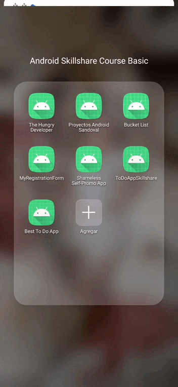
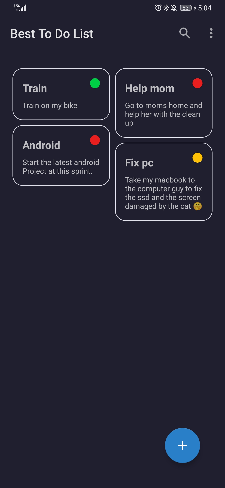
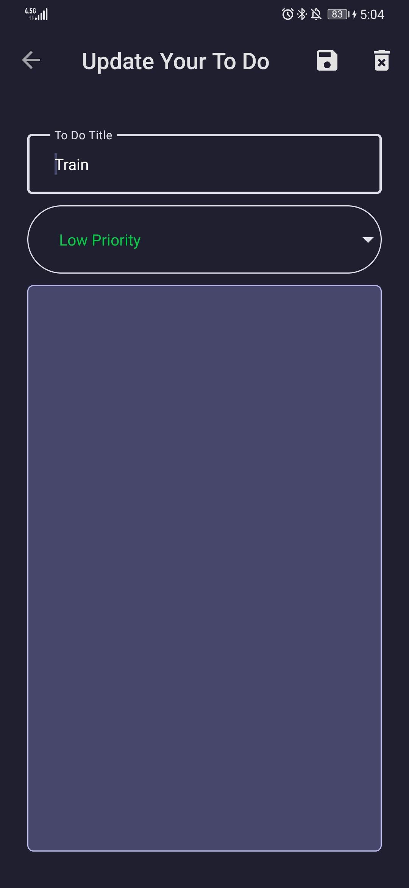
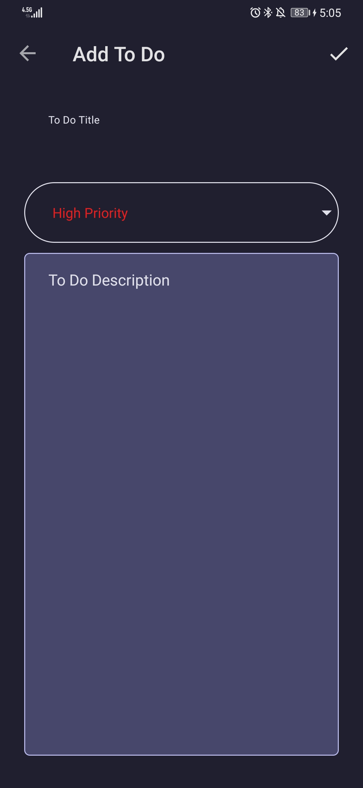
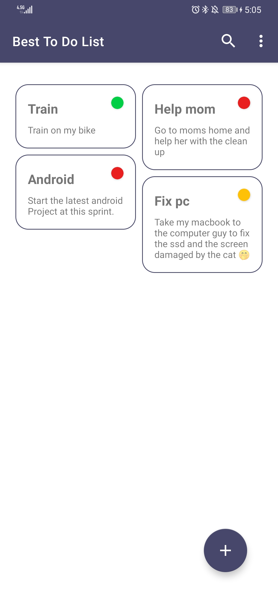
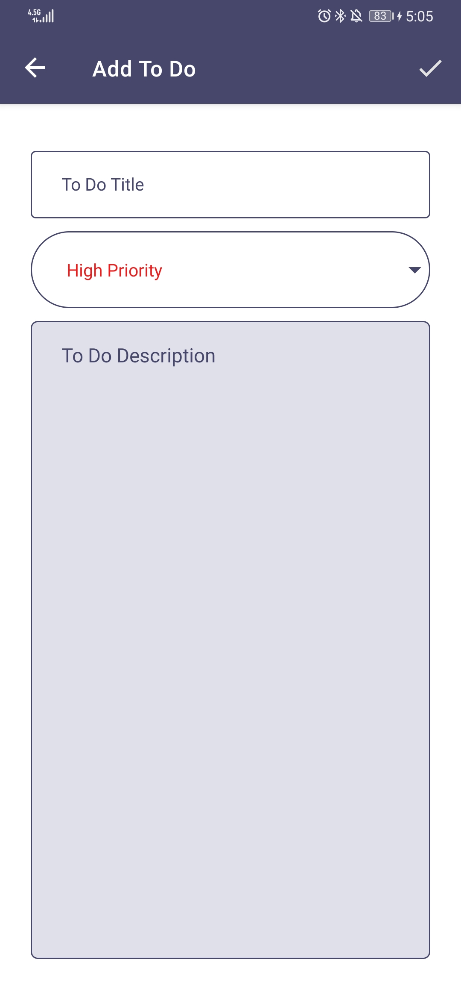
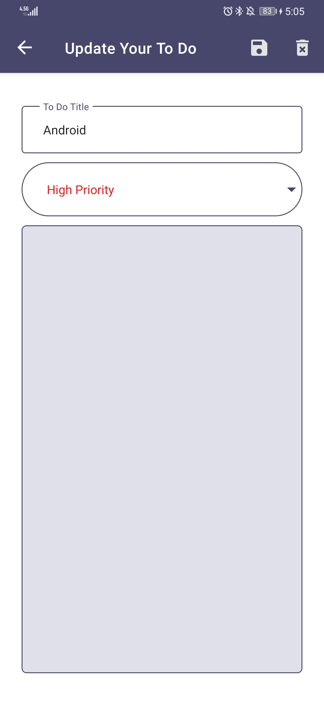
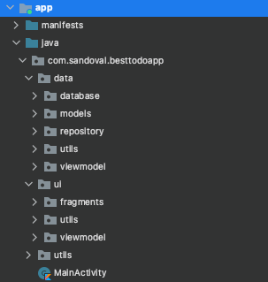

## Best To Do App
[](http://kotlinlang.org/)
[](https://lv.binarybabel.org/catalog/gradle/latest)
[](http://www.apache.org/licenses/LICENSE-2.0)



Best To Do App is a sample project that presents modern, 2021 approach to [Android](https://www.android.com/) application development using [Kotlin](https://kotlinlang.org/) and latest tech-stack.

The goal of the project is to demonstrate best practices, provide a set of guidelines, and present modern Android
application architecture that is modular, scalable, and maintainable. This application may look simple, but it
has all of these small details that will set the rock-solid foundation of the larger app suitable for bigger teams and
long application lifecycle management.

## Table of Contents

-   [Development](https://github.com/juanchosandox90/BestToDoApp#development)
-   [Design](https://github.com/juanchosandox90/BestToDoApp#design)
-   [Architecture](https://github.com/juanchosandox90/BestToDoApp#architecture)
-   [Documentation](https://github.com/juanchosandox90/BestToDoApp#documentation)
-   [Tech-stack](https://github.com/juanchosandox90/BestToDoApp#tech-stack)
-   [Resources](https://github.com/juanchosandox90/BestToDoApp#resources)
-   [Contributions](https://github.com/juanchosandox90/BestToDoApp#contributions)
-   [Authors](https://github.com/juanchosandox90/BestToDoApp#authors)
-   [License](https://github.com/juanchosandox90/BestToDoApp#license)

## Development

### Environment setup

First off, you require the latest Android Studio 4.1.0 (or newer) to be able to build the app.

## Design

In terms of design has been followed recommendations [android material design](https://developer.android.com/guide/topics/ui/look-and-feel) comprehensive guide for visual, motion, and interaction design across platforms and devices. Granting the project in this way a great user experience (UX) and user interface (UI). For more info about UX best practices visit [link](https://developer.android.com/topic/google-play-instant/best-practices/apps).

Moreover, has been implemented support for [dark theme](https://developer.android.com/guide/topics/ui/look-and-feel/darktheme) with the following benefits:
-   Can reduce power usage by a significant amount (depending on the device’s screen technology).
-   Improves visibility for users with low vision and those who are sensitive to bright light.
-   Makes it easier for anyone to use a device in a low-light environment.

| Mode  | List Fragment                                                        | Update Fragment                                                          | Add Fragment                                                          |
|-------|--------------------------------------------------------------------------|------------------------------------------------------------------------------|---------------------------------------------------------------------------|
| Light |  |  |  |
| Dark  |   |   |   |

## Architecture

The architecture of the application is based, apply and strictly complies with each of the following 5 points:



-   A single-activity architecture, using the [Navigation component](https://developer.android.com/guide/navigation/navigation-getting-started) to manage fragment operations.
-   [Android architecture components](https://developer.android.com/topic/libraries/architecture/), part of Android Jetpack for give to project a robust design, testable and maintainable.
-   Pattern [Model-View-ViewModel](https://en.wikipedia.org/wiki/Model%E2%80%93view%E2%80%93viewmodel) (MVVM) facilitating a [separation](https://en.wikipedia.org/wiki/Separation_of_concerns) of development of the graphical user interface.
-   [S.O.L.I.D](https://en.wikipedia.org/wiki/SOLID) design principles intended to make software designs more understandable, flexible and maintainable.
-   [Modular app architecture](https://proandroiddev.com/build-a-modular-android-app-architecture-25342d99de82) allows to be developed features in isolation, independently from other features.


## Documentation

The documentation is generated following [KDoc](https://kotlinlang.org/docs/reference/kotlin-doc.html) language (the equivalent of Java's [JavaDoc](https://en.wikipedia.org/wiki/Javadoc)) via documentation engine for Kotlin [Dokka](https://github.com/Kotlin/dokka).

To consult it check this [link](https://github.com/juanchosandox90/BestToDoApp)

## Tech-stack

This project takes advantage of many popular libraries, plugins and tools of the Android ecosystem. Most of the libraries are in the stable version, unless there is a good reason to use non-stable dependency.

### Dependencies

-   [Jetpack](https://developer.android.com/jetpack):
    -   [Android KTX](https://developer.android.com/kotlin/ktx.html) - provide concise, idiomatic Kotlin to Jetpack and Android platform APIs.
    -   [AndroidX](https://developer.android.com/jetpack/androidx) - major improvement to the original Android [Support Library](https://developer.android.com/topic/libraries/support-library/index), which is no longer maintained.
    -   [Data Binding](https://developer.android.com/topic/libraries/data-binding/) - allows you to bind UI components in your layouts to data sources in your app using a declarative format rather than programmatically.
    -   [Lifecycle](https://developer.android.com/topic/libraries/architecture/lifecycle) - perform actions in response to a change in the lifecycle status of another component, such as activities and fragments.
    -   [LiveData](https://developer.android.com/topic/libraries/architecture/livedata) - lifecycle-aware, meaning it respects the lifecycle of other app components, such as activities, fragments, or services.
    -   [Navigation](https://developer.android.com/guide/navigation/) - helps you implement navigation, from simple button clicks to more complex patterns, such as app bars and the navigation drawer.
    -   [Room](https://developer.android.com/topic/libraries/architecture/room) - persistence library provides an abstraction layer over SQLite to allow for more robust database access while harnessing the full power of SQLite.
    -   [ViewModel](https://developer.android.com/topic/libraries/architecture/viewmodel) - designed to store and manage UI-related data in a lifecycle conscious way. The ViewModel class allows data to survive configuration changes such as screen rotations.
    -   [Coroutines](https://kotlinlang.org/docs/reference/coroutines-overview.html) - managing background threads with simplified code and reducing needs for callbacks.
    -   [Recycler View Animations](https://github.com/wasabeef/recyclerview-animators) - Manage the recycler view custom animations
    -   [AestheticDialogs](https://github.com/gabriel-TheCode/AestheticDialogs) - Manage the custom dialogs of the app

### Best practices

Avoid reinventing the wheel by following these guidelines:

-   [Google best practices](https://developer.android.com/distribute/best-practices)
-   [Android development best practices](https://github.com/futurice/android-best-practices)

### Codelabs

Google Developers Codelabs provide a guided, tutorial, hands-on coding experience. Most codelabs will step you through the process of building a small application, or adding a new feature to an existing application. They cover a wide range of android concepts to learn and practice:

-   [Android Developer Fundamentals](https://developer.android.com/courses/fundamentals-training/toc-v2)
-   [Android Developer Codelabs](https://codelabs.developers.google.com/?cat=Android)

## Contributions

All contributions are welcome!
Please feel free to post questions, recommendations, ideas, bugs by create [new issue](https://github.com/juanchosandox90/BestToDoApp/issues) following the template or if you want create directly [new pull request](https://github.com/juanchosandox90/BestToDoApp/pulls).

## Authors

<a href="https://www.facebook.com/costa27/" target="_blank">
  
</a>

**Juan Camilo Sandoval Devia**

[](https://www.linkedin.com/in/juan-camilo-sandoval-devia-a33955a5/)

## License

```license
Copyright 2021 Juan Camilo Sandoval

Licensed under the Apache License, Version 2.0 (the "License");
you may not use this file except in compliance with the License.
You may obtain a copy of the License at

    http://www.apache.org/licenses/LICENSE-2.0

Unless required by applicable law or agreed to in writing, software
distributed under the License is distributed on an "AS IS" BASIS,
WITHOUT WARRANTIES OR CONDITIONS OF ANY KIND, either express or implied.
See the License for the specific language governing permissions and
limitations under the License.
```
